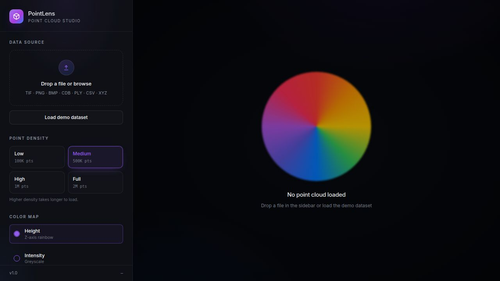

# 3D Viewer

An offline-first desktop and web viewer for industrial **3D height-map / point-cloud** files produced by LMI Gocator, Keyence, and Cognex VisionPro 3D scanners. Drop a file in, see the point cloud render in 3D with colored elevation, pan/orbit/zoom freely.



---

## What this app can do

### Supported file formats

| Format | Extension | Source | Notes |
|---|---|---|---|
| **LMI Gocator 3D TIFF** | `.tif`, `.tiff` | LMI Gocator sensors | 16-bit / 32-bit float height maps. Auto-detects planar vs interleaved layouts and picks the Z channel automatically. |
| **LMI Gocator 3D PNG** | `.png` | LMI Gocator export | 16-bit grayscale height encoding. |
| **Keyence 3D BMP** | `.bmp` | Keyence LJ-X / VK series | RGB-packed 24-bit height encoding. Byte-order (RGB vs BGR) is auto-detected per file. |
| **Cognex CDB** | `.cdb` | Cognex VisionPro 3D / DSMax | Big-endian uint16 height samples with auto-detected image width. |
| **Plain point clouds** | `.csv`, `.txt`, `.xyz` | Any tool | X Y Z (and optional intensity) per row. Header row tolerated. |
| **Generic raw** | `.bin`, `.raw`, `.lmi` | Custom dumps | Treated as raw float arrays. |

### Visualization features

- **GPU-accelerated 3D rendering** via Three.js with smooth pan, orbit, and zoom (mouse + touchpad).
- **Colored elevation maps** — pick from rainbow (linear or equalized), viridis, plasma, magma, or grayscale. The equalized rainbow spreads color across the actual data distribution so subtle surface variation pops.
- **Adaptive height range** — defaults to the 5th–95th percentile of Z so noise and outliers don't flatten the colors.
- **Live z-clipping** with the GPU so you can slice the cloud to inspect interior regions without re-uploading.
- **Density control** — choose how many points to render (faster preview vs full detail) up to 1,000,000 samples per file. Larger files are auto-decimated for performance.
- **Color legend** — always-on legend showing the Z range mapped to color.
- **Empty / error states** — clear messages when a file has no valid samples (e.g. an all-zero CDB) instead of a silent crash.

### Two ways to run it

| Mode | When to use | How |
|---|---|---|
| **Desktop app (Windows native)** | Daily use, offline, no browser | Double-click `launch.bat`. Builds a native Tauri app the first time (~10–15 min), then opens instantly on subsequent launches. |
| **Web dev server** | Quick check on any OS, development | `pnpm install` then `pnpm --filter @workspace/point-cloud-viewer run dev` — open the URL it prints. |

### Privacy / network

- **100% local.** No file ever leaves your machine. There is no upload, no cloud, no telemetry, no account.
- The web/dev mode runs entirely in your browser. The desktop mode runs in a sandboxed Tauri (WebView2) window.

---

## Quick start (Windows desktop)

You need a Windows 10 (recent build) or Windows 11 PC. Nothing else — the launch script auto-installs every prerequisite (Node.js, pnpm, Rust, the Visual Studio C++ Build Tools, and the WebView2 runtime) using `winget`.

```bash
git clone https://github.com/rk8443/3d-viewer.git
cd 3d-viewer
```

Then in File Explorer, double-click **`launch.bat`** and click **Yes** on the UAC prompts that appear during the one-time installs.

- **First run:** 15–25 minutes total (most of it is the one-time MSVC Build Tools install ~1.5 GB, plus the first Rust compile).
- **Every run after:** opens in ~1 second — the script detects the cached `3D Viewer.exe` and launches it immediately with no checks.

To install as a proper Windows MSI / EXE installer with Start Menu entry and desktop shortcut, see [`artifacts/point-cloud-viewer/src-tauri/BUILD-WINDOWS.txt`](artifacts/point-cloud-viewer/src-tauri/BUILD-WINDOWS.txt).

### If `launch.bat` can't install something (locked-down / non-admin PC)

The script needs admin rights to install Node.js, MSVC Build Tools, etc. If your account can't elevate (corporate / managed device, no UAC permission, blocked installers, no `winget`), ask IT to install these — or install them yourself once admin is granted — then re-run `launch.bat`. The script auto-detects each one and skips ahead.

| # | Dependency | What it is | Download | Install notes |
|---|---|---|---|---|
| 1 | **Node.js 20 LTS** | JavaScript runtime + npm | https://nodejs.org/en/download/prebuilt-installer (pick **Windows / x64 / .msi**) | Double-click the MSI. Default options are fine. Adds `node` and `npm` to PATH. |
| 2 | **pnpm** | Package manager (used by this repo) | Installed automatically by Node.js via Corepack. If that fails, run in PowerShell: `npm install -g pnpm` | Needs Node.js installed first. |
| 3 | **Visual Studio 2022 Build Tools** with **"Desktop development with C++"** workload + **Windows 11 SDK** | C/C++ compiler + linker that Rust needs on Windows | https://visualstudio.microsoft.com/downloads/?q=build+tools (scroll to "Tools for Visual Studio" → "Build Tools for Visual Studio 2022") | ~1.5 GB. In the installer's "Workloads" tab, tick **Desktop development with C++**. Leave the default optional components checked. |
| 4 | **Rust (stable, MSVC toolchain)** | Compiler for the Tauri desktop shell | https://win.rustup.rs/x86_64 (downloads `rustup-init.exe`) | Run `rustup-init.exe`, accept defaults (option 1). Requires #3 to already be installed. |
| 5 | **Microsoft Edge WebView2 Runtime** | Embedded browser engine the app renders inside | https://developer.microsoft.com/microsoft-edge/webview2 (pick **Evergreen Standalone Installer / x64**) | Already present on Windows 11 and most up-to-date Windows 10. |
| 6 | **Git for Windows** | Needed to `git clone` and `git pull` | https://git-scm.com/download/win | Only needed if you're cloning the repo (skip if you downloaded the zip). |

After all of these are installed, open a **new** PowerShell or Command Prompt window (so PATH updates take effect), `cd` into the `3d-viewer` folder, and double-click `launch.bat` again. The script will detect each tool, skip the install step, and jump straight to building the desktop app.

#### Fully offline / portable alternative (no installs needed)

If you can't install anything system-wide, you can still run the viewer in a browser:

1. Download Node.js as a **zip** (not MSI) from https://nodejs.org/en/download/prebuilt-binaries → "Windows / x64 / .zip". Unzip anywhere.
2. Open PowerShell, then run:
   ```powershell
   $env:Path = "C:\path\to\node-v20.18.1-win-x64;$env:Path"
   cd 3d-viewer
   npm install -g pnpm
   pnpm install
   pnpm --filter @workspace/point-cloud-viewer run dev
   ```
3. Open the URL it prints (typically `http://localhost:1420`) in any modern browser.

This skips the desktop wrapper entirely — no admin, no Rust, no MSVC needed. You lose the standalone window but get all the viewer features.

## Quick start (browser / dev mode, any OS)

```bash
git clone https://github.com/rk8443/3d-viewer.git
cd 3d-viewer
pnpm install
pnpm --filter @workspace/point-cloud-viewer run dev
```

Open the printed URL (typically `http://localhost:1420`). On macOS / Linux you can also run `./launch.sh` for an auto-installing desktop build.

---

## Limitations

Knowing what this is *not* will save you time:

### File-format limitations
- **Only depth / height-map files are supported.** Regular RGB photos saved as TIFF or PNG won't render meaningfully — the app interprets pixel values as Z heights.
- **LMI TIFF:** 8-bit TIFFs are not supported. The app expects 16-bit integer or 32-bit float samples.
- **Keyence BMP:** assumes the 24-bit Keyence height encoding. Plain photographic BMPs will produce noise.
- **Cognex CDB:** the parser requires at least 100 valid (non-zero, non-NaN) samples to detect a usable image. Files that are entirely zero (e.g. blank captures) throw a clear "no valid Z samples" error instead of rendering an empty scene.
- **No mesh formats.** STL, OBJ, PLY, E57, LAS/LAZ, and PCD are *not* supported. This tool is for raster height maps and simple XYZ text only.
- **No metadata extraction.** Camera calibration, sensor pose, or scan parameters embedded by the scanner are ignored. You see geometry only.

### Rendering limitations
- **Max 1,000,000 points rendered** at once. Larger clouds are randomly decimated. The original file is never modified.
- **Single cloud at a time.** No side-by-side comparison or overlay. Drop a new file to replace the current one.
- **No measurement tools.** No distance, angle, volume, plane fit, deviation maps, or annotation. View-only.
- **No exporting.** You can't save the rendered cloud back out as PLY/STL/etc. — this is purely a viewer.
- **No animation, no time series.** Single-frame snapshots only.

### Desktop / build limitations
- **MSI installers can only be built on Windows.** The included `build-windows.ps1` and `launch.bat` require a Windows machine — Microsoft's WiX toolkit and NSIS bundler do not run on Linux or macOS.
- **First Windows build is slow** (~10–15 min) because the Rust toolchain compiles the Tauri shell from scratch. Subsequent builds use cached artifacts and finish in ~3 min.
- **No code signing.** The MSI/EXE is unsigned, so Windows SmartScreen will show a warning on first launch ("More info" → "Run anyway"). For internal use this is fine; for distribution you'd need a code-signing certificate.
- **No auto-update mechanism.** When you push new code to GitHub from Replit, the launch script keeps using the cached `3D Viewer.exe`. To pick up changes: `git pull`, delete `artifacts/point-cloud-viewer/src-tauri/target/release/3D Viewer.exe`, then re-run `launch.bat`.
- **Windows 10/11 64-bit only.** No 32-bit, no ARM, no Windows 7/8.
- **WebView2 runtime required** (already present on Windows 11; auto-installs on Windows 10).

### General
- **Not for huge production scans.** Files much larger than ~50–100 MB will load slowly because the entire file is decoded in browser memory before decimation. For multi-gigabyte LAS/LAZ point clouds, use CloudCompare or MeshLab instead.

---

## Project structure

```
.
├── launch.bat / launch.ps1 / launch.sh   # One-click run scripts
├── artifacts/
│   └── point-cloud-viewer/               # The React + Three.js viewer
│       ├── src/                          # UI, parsers, hooks
│       └── src-tauri/                    # Native desktop wrapper (Rust + Tauri v2)
│           ├── build-windows.ps1         # Builds MSI + EXE installers
│           └── BUILD-WINDOWS.txt         # Step-by-step build guide
└── README.md                             # You are here
```

## Tech stack

- **Frontend:** React 19 + Vite + TypeScript + Three.js + Tailwind + shadcn/ui
- **Desktop shell:** Tauri v2 (Rust) — bundles to MSI + NSIS .exe on Windows
- **Parsers:** custom TypeScript decoders for LMI TIFF/PNG, Keyence BMP, Cognex CDB
- **Build:** pnpm workspaces, esbuild

---

## License

Private project — no license granted by default. Contact the repository owner before redistributing.
